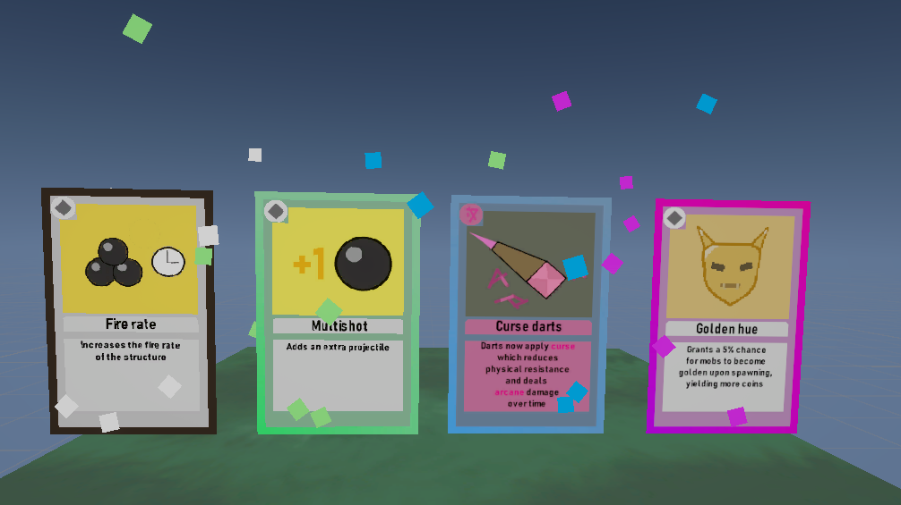
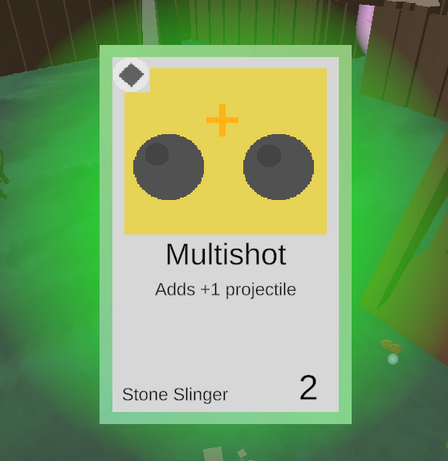
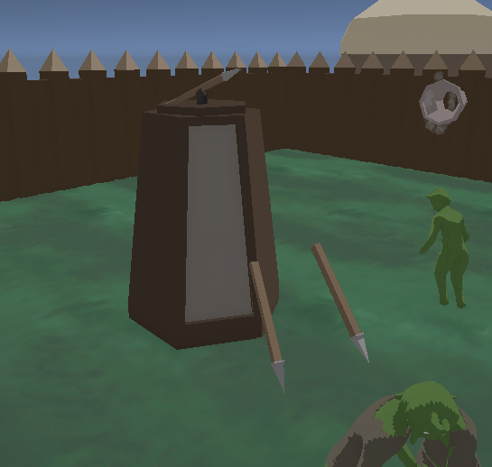
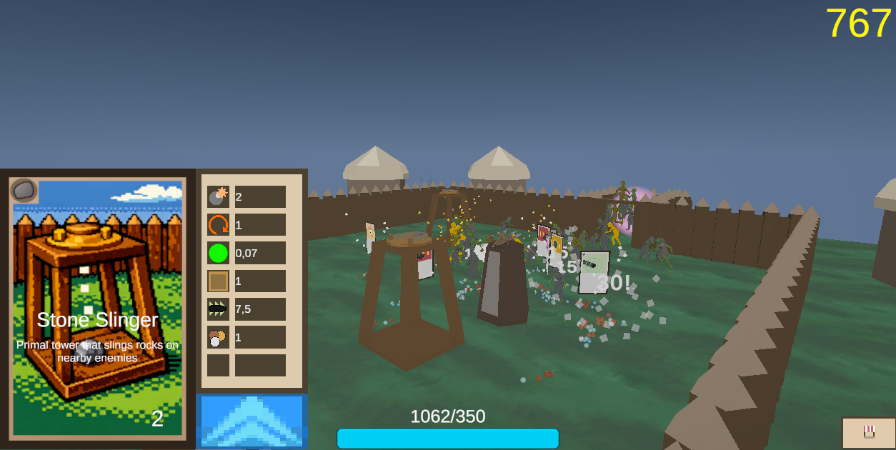
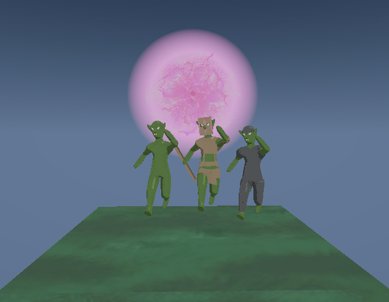

### Idle Tower - Unity C# Prototype

## Concept

My idea was to make a idle game, but one that is more interactive with smooth, satisfying progression. Player start with a simple tower, and a enemies spawning into the arena at a slow phase. As the tower kills more and more enemies, the player can add more towers, upgrade the existing ones, and increase the rate of which enemies spawn and the loot that is yielded

## 🎴 Cards

This is the core concept behind unlocking new towers and upgrades. As the player kills more and more enemies, they have a chance to drop cards. These cards can be upgrades, new towers, new enemy types. Once a player has unlocked a card they are able to use it to increase the rate at which they are gathering money.

Card are split up into the classic RPG rarity system:
- Common
- Uncommon
- Rare
- Epic
- Legendary

The chance of each respective rarity dropping are increasingly small. This adds some level of randomness to the progression.

> **Code:** Cards are implemented using a abstract class and scriptable objects. New card behavior is easy to implement using abstraction, and is easily tweakable to its respective towers using scriptable objects.

## 🏹 Towers

This is the players way to kill enemies that spawn into the stage. All towers have their own respective stats, xp, and level. Once a tower levels up, you get a deck of 3 random upgrade cards you can choose from from the available cards that the player has unlocked. This adds another layer of randomness to the game.
Towers have different behaviors. Some target nearby enemies, some deploy traps, but they all have common stats making the upgrade system work without needing to implement new cards for every tower. 

## 🧌 Enemies

- Spawns from portals located around the map
- Simple behavior, runs frantically around the map
- Drops loot upon death that player can use to upgrade or add new towers

> **Code:** Pathfinding is very simple so far, no search algortihms used yet. They simply find a random position within bounds and run to that position. Once it reaches the position it repeats the process

