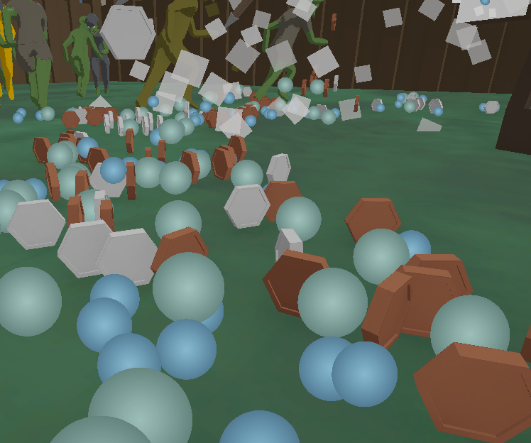

### Idle Tower - Unity C# Prototype

## Concept

My idea was to make a idle game, but one that is more interactive, and te progression feels smooth. Player start with a simple tower, and a enemies spawning into the arena at a slow phase. As the tower kills more and more enemies, the player can add more towers, upgrade the existing ones, and increase the rate of which enemies spawn and the loot that is yielded

## 🎴 Cards

This is the core concept behind unlocking new towers and upgrades. As the player kills more and more enemies, they have a chance to drop cards. These cards can be upgrades, new towers, new enemy types. Once a player has unlocked a card they are able to use it to increase the rate at which they are gathering money.

Card are split up into the classic RPG rarity system:
- Common
- Uncommon
- Rare
- Epic
- Legendary

The chance of each respective rarity dropping are increasingly small. This adds some level of randomness to the progression.

## 💥 Towers

This is the players way to kill enemies that spawn into the stage. All towers have their own respective stats, xp, and level. Once a tower levels up, you get a deck of 3 random upgrade cards you can choose from from the available cards that the player has unlocked. This adds another layer of randomness to the game.
Towers have different behaviors. Some target nearby enemies, some deploy traps, but they all have common stats making the upgrade system work without needing to implement new cards for every tower. 

## 🧌 Enemies

The enemies spawn at a steady rate from portals, which are spread out on the map. They do not have any behavior other than running around, picking a random location in the arena and running to it. They simply serve as the games way of earning money. 

Once a enemy is killed it drops coins and xp, that in turn can be used to buy more towers or upgrade them. The loot dropped by an enemy depends on its strength, and in turn a enemies strength makes it tougher to kill. Its therefore up to the player to optimize his own farms to make the most money per second.

## ⌨️ Code

### Cards

I used abstraction and scriptable objects to make new cards easy to implement. The upgradecards have a simple overridable ApplyUpgrade() function, that can be tweaked to fit new game logic. Later i plan to add more abstraction, so all cards are uniform

### Tower behavior

By using switch statements combined with enums i can alter what code that runs depending on the setting the tower is set to. Even though towers have different behaviors they can share stats like: Attack speed, Damage, Size, Range, and more. Using scriptable objects in unity, you can tweak the upgrades while still keeping the same behavior per tower.

### Enemy behavior

Enemy behavior is very barebones at this point, with no search algorithms or similar for their pathfidning. Their pathfinding consist of finding a random point in a grid, using a boxcollider, then running to it. Once a enemy reaches its destination it simply finds a new spot using random values within the width of a box collider and repeats.

